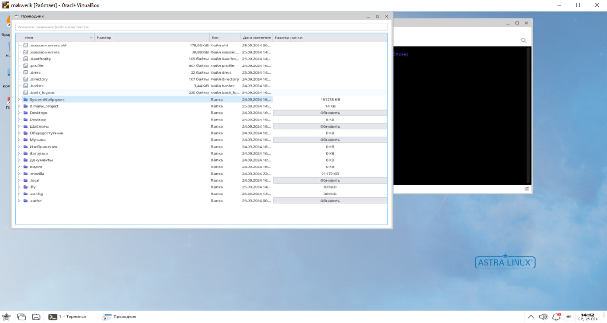

# File Explorer 

## Описание проекта

Данный проект представляет собой простой проводник для отображения структуры файлов и папок на системе. Для каждой папки предусмотрен отдельный столбец с кнопкой "Обновить". При нажатии на кнопку для конкретной папки отображается ее размер в КБ.

## Функциональность

- Отображение структуры файлов и папок.
- Для каждой папки предусмотрена кнопка "Обновить" для получения размера папки.
- Отображение размера папки в КБ после нажатия на кнопку.

## Проблемы при установке зависимостей

При установке зависимостей возникла проблема с доступом к репозиторию системы Astra Linux, что привело к невозможности установки пакета `pyqt5-examples`. Конкретно, был недоступен следующий репозиторий:

[https://download.astralinux.ru/astra/stable/1.8_x86-64/repository-devel/dists/1.8_x86-64/](https://download.astralinux.ru/astra/stable/1.8_x86-64/repository-devel/dists/1.8_x86-64/)

По этой причине установка пакета `pyqt5-examples` не удалась.

**P.s. Не знаю, насколько я справился, но я старался на все 186 строк кода из 186! 🚀**

